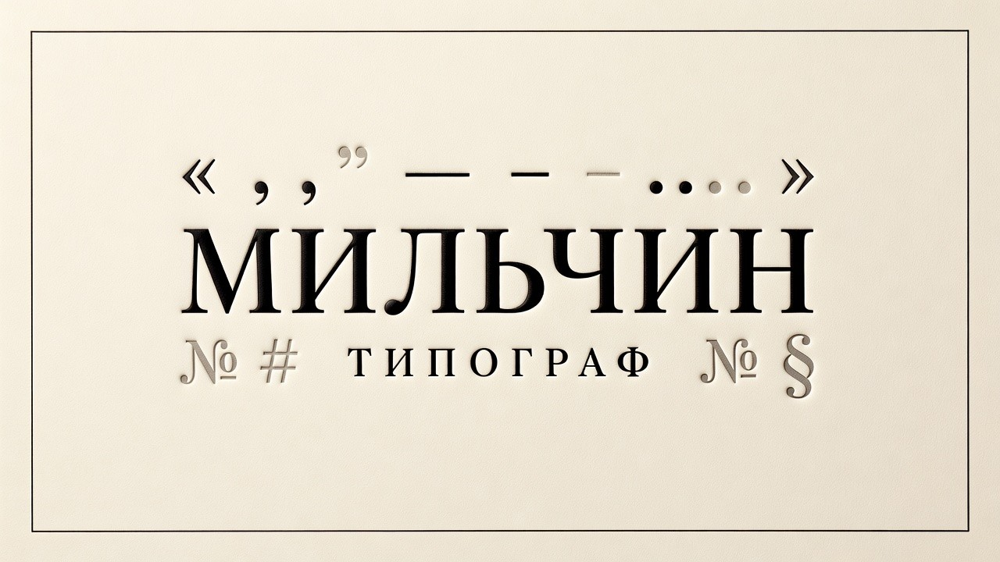

<p align="center">
  
</p>

# Мильчин

> **Claude Code-скил (команда `/milchin`): типограф русского текста. Ёлочки и лапки, тире (длинное/короткое/дефис), неразрывные пробелы, многоточие, юникод-гигиена (омоглифы, zero-width, BOM, mojibake). Детерминированный Python-скрипт — 0 токенов LLM, миллисекунды на лонгрид, полная воспроизводимость. То, что у любого нормального русского текста должно быть «по умолчанию», но почему-то не бывает.**

[](LICENSE)
[](https://docs.claude.com/en/docs/claude-code/overview)
[](https://www.python.org/)

Даёте текст или путь к файлу — Claude прогоняет встроенный скрипт `milchin.py`,
который применяет более 30 однозначных правил русской типографики и юникод-гигиены.
Возвращает исправленный текст и сводку по рядам правил (T/D/W/S).

```
/milchin file.md
→ milchin: правок всего 47
→   T1     8   (прямые "..." → «ёлочки»)
→   T5     22  (NBSP после однобуквенных предлогов)
→   T6     5   (NBSP между числом и единицей)
→   T9     8   (NBSP перед em-dash)
→   W1     2   (омоглифы: латинская «о» в кириллическом слове)
→   W2     2   (zero-width мусор)
```

---

## Зачем

Русская типографика — это много мелочей, которые **по правилу** делаются всегда
одинаково, но **руками** забываются всегда. Кавычки-`"программистские"` вместо
`«ёлочек»`, дефис вместо тире, висящий предлог на конце строки, латинская `о`
притаившаяся в слове «оператор», невидимый zero-width мусор после копирования
из браузера. Каждое — секунда, в сумме — час на лонгрид.

LLM-корректоры умеют это править, но дорого: токены, медленно, нестабильно,
галлюцинируют. А правило-то однозначное. Тире после однобуквенного предлога —
ВСЕГДА с неразрывным пробелом. Числовой диапазон 1941-1945 — ВСЕГДА через
короткое тире (1941–1945). Тут нечего обдумывать.

«Мильчин» — это перевод этих правил в Python. Чистый stdlib, ничего внешнего,
запускается одним вызовом. На вход — текст или файл, на выход — типографированный
текст и список правок.

Имя — в честь Аркадия Эммануиловича Мильчина (1924–2014), автора «Справочника
издателя и автора» — канонической библии русской книжной типографики.

## Что делает

Скрипт реализует ТОЛЬКО детерминированные правила — те, где правильный ответ не
зависит от смысла фразы. Если правило требует понимания смысла (минус ли это или
дефис, разделитель тысяч или год, грамматика, пунктуация по интонации) — оно
не реализовано. Лучше пропустить, чем сломать.

### Четыре ряда правил

**T — базовая типографика**
- T1: прямые `"..."` → «ёлочки» (с учётом вложенности → „лапки")
- T3: дефис между словами (с пробелами) → em-dash (—); `--`/`---` тоже → em-dash
- T4: числовой диапазон `\d-\d` → en-dash (3–5, 1941–1945)
- T5: NBSP после однобуквенных предлогов и союзов (в, к, с, и, а…)
- T6: NBSP между числом и единицей (5 кг, 10 %, № 5)
- T9: NBSP перед em-dash
- T11: сокращения «т. е.», «и т. д.» — NBSP внутри
- T12: многоточие `...` → `…`
- T14–T16: лишние пробелы (двойные, перед знаком, после открывающей скобки) убираются
- T24: пробел после `,;:!?`, если знак слип со словом («Короче,рассказываю» → «Короче, рассказываю»)
- D8: NBSP перед «гг.» после года (1990–1995 гг.)

**D — расширенная типографика** (наследуется в T-ряде)

**W — веб и юникод-гигиена**
- W1: омоглифы — латинские буквы внутри кириллического токена → кириллица (TR39 confusables)
- W2: удаление zero-width / invisible (ZWSP, ZWNJ, WJ, LRM/RLM, math invisibles)
- W3: strip ведущего BOM (U+FEFF)
- W4: английские «умные» кавычки в русском контексте → ёлочки
- W6: mojibake closed-list (`â€"` → em-dash, `Â`+пробел → NBSP)
- W9: NFC-нормализация входа
- W14: soft hyphen U+00AD убрать
- W15: узкие пробелы (U+202F, U+2009, U+2007) → NBSP/обычный

**S — научно-техническое (безопасные)**
- S1: знак умножения единиц `x/х/*` → `·` (только между обозначениями единиц)
- S6: угловые градусы/минуты/секунды слитно с числом (20°), но °C/°F не трогаем
- S23: № + NBSP перед числом

### Спорные правила (под флагами)

- `--percent-space` (T7): NBSP перед `%` (по умолчанию OFF — слитно «10%»)
- `--no-initials-space` (T10): не привязывать инициалы NBSP (по умолчанию ON — «А. С. Пушкин»)

## Что НЕ делает

Зоны, где автозамена ломает смысл. Это работа LLM-скила (`/rozental` для нормы,
`/chukovsky` для стиля) или живого редактора:

- **Минус vs дефис в формулах/температуре** (`-5°` vs `−5°`) — неотличимы без контекста
- **Разряды больших чисел** — риск задеть годы, телефоны, ID
- **Десятичный разделитель `.` → `,`** — неотличим от версий/дат/IP
- **Прямая речь, перестановка знаков у кавычек** — требует анализа
- **Буква ё** — редполитика, не норма
- **Наращения порядковых** (1-й/2-го) — стилистика
- **Орфография, пунктуация по смыслу, согласование, управление** — для этого `/rozental`
- **Стиль, голос, структура** — для этого `/chukovsky`
- **AI-маркеры и нейрослоп** — для этого `/slopotron`

### Защита зон

До любой правки скрипт прячет в плейсхолдеры:
- YAML-фронтматтер (`---…---` в начале файла — там кавычки/двоеточия это синтаксис)
- inline-code `` `…` `` и fenced-блоки
- URL (http/https)
- markdown-ссылки `[текст](url)` — текст типографим, url не трогаем
- @mentions и #hashtags

Это значит, что **код, ссылки, метаданные и упоминания не пострадают** от автозамены
кавычек или тире. URL `https://example.com` останется `https://example.com`, а не
«https://example.com».

Плюс **markdown-safe**: маркеры списков (`- пункт` в начале строки) и тире диалогов
не превращаются в em-dash, ведущий отступ вложенных списков не схлопывается. В em-dash
идёт только дефис между словами в середине строки.

## Режимы работы

| Режим | Когда | Что делает |
|-------|-------|------------|
| **Fix** (по умолчанию) | «прогони через Мильчина», «типограф», «/milchin» | исправляет и отдаёт текст в stdout |
| **Check** | «только проверка», «что бы поправил» | не меняет; счётчики правил в stderr |
| **Report** | «исправь и покажи отчёт» | исправленный текст + сводка |
| **Selftest** | при правках в скрипте | прогоняет 49 встроенных тестов |

## Установка

Скил — два файла в папке `.claude/` плюс сам скрипт. Скопируйте их в свой проект
**или** в глобальную папку Claude Code (`~/.claude/`), чтобы скил был доступен везде.

**В конкретный проект:**
```bash
git clone https://github.com/beaverbeard/milchin.git
cp -r milchin/.claude/skills/milchin      .claude/skills/
cp    milchin/.claude/commands/milchin.md .claude/commands/
```

**Глобально (во все проекты):**
```bash
cp -r milchin/.claude/skills/milchin      ~/.claude/skills/
cp    milchin/.claude/commands/milchin.md ~/.claude/commands/
```

Перезапустите Claude Code — скил «Мильчин» (`milchin`) и команда `/milchin`
появятся в списке.

### Без Claude Code

Скрипт самодостаточен и работает отдельно — как обычная unix-утилита:

```bash
# Прогон по файлу
python3 milchin.py --file article.md --fix > article.md.tmp && mv article.md.tmp article.md

# Через пайп
echo 'Это - тест 5 кг.' | python3 milchin.py --fix
# → Это — тест 5 кг.

# Только проверка
python3 milchin.py --file article.md --check
# → milchin: правок всего 21

# Тесты
python3 milchin.py --selftest
# → 49 PASS, 0 FAIL из 49
```

Можно положить в `~/.local/bin/milchin` (с `chmod +x`) и пользоваться как
системной командой.

## Примеры

<p align="center">
  <br>
  <sub><i>Детерминированный движок: на входе сырьё, на выходе — чистая типографика. Без LLM, 0 токенов.</i></sub>
</p>

**До:**
```
"Кавычки" - вот так. Документ 5 кг, диапазон 1941-1945.
Текст с латинской o в слове оператор. NBSP-мусора нет.
```

**После `milchin --fix`:**
```
«Кавычки» — вот так. Документ 5 кг, диапазон 1941–1945.
Текст с латинской о в слове оператор. NBSP-мусора нет.
```

Невидимое (показано как `·`):
- `5·кг` — NBSP между числом и единицей
- `с·—` — NBSP перед em-dash
- `в·слове` — NBSP после однобуквенного предлога

## Скилы для рИИдакторов

«Мильчин» — скил для редакторов из семьи **[рИИдактор](https://redaktozavr.ru/rAIdactor?utm_source=skills)**, рассылки про
работу редактора с ИИ. Каждый скил семьи закрывает свою зону, не пересекаясь:

| Скил | Зона | Природа |
|------|------|---------|
| [Бахтин](https://github.com/beaverbeard/bakhtin) | Генерация черновика: multi-agent, 7 форматов | LLM |
| [Чуковский](https://github.com/beaverbeard/chukovsky) | Смысл, структура, голос, канцелярит | LLM |
| [Розенталь](https://github.com/beaverbeard/rozental) | Орфография, пунктуация, согласование, единообразие | LLM |
| [Слопотрон](https://github.com/beaverbeard/slopotron) | AI-маркеры и нейрослоп | LLM |
| **Мильчин** | Типографика и юникод-гигиена | **Скрипт** |
| [Аграновский](https://github.com/beaverbeard/agranovsky) | Верификация фактов: числа, цитаты, законы, ссылки | LLM + поиск |
| [Виноградов](https://github.com/beaverbeard/vinogradov) | Сборка авторского голоса (Voice DNA) из корпуса | Скрипт + LLM |

Канонический порядок при полной вычитке:
**Чуковский → Аграновский → Слопотрон → Розенталь → Мильчин** (смысл → истина → детектор → буква → форма). Аграновский — обязательный фактчек, идёт сразу за Чуковским.

Рядом с конвейером вычитки — **[Виноградов](https://github.com/beaverbeard/vinogradov)**: он не правит текст, а собирает авторский голос (Voice DNA) из реального корпуса — тот самый, которым потом пишут и под который вычитывают остальные.

Мильчин идёт **последним** среди типографических шагов: его правки невидимые
(NBSP, омоглифы), и если LLM-скил после него снова перепечатает текст —
механика стёрётся. Поэтому скрипт-типограф закрывает финальный шаг.
## Лицензия

[MIT](LICENSE) — берите, форкайте, ломайте, чините.

Имя «Мильчин» используется как почтительная аллюзия на классика, без претензии
на ассоциацию с его наследниками или правообладателями.
